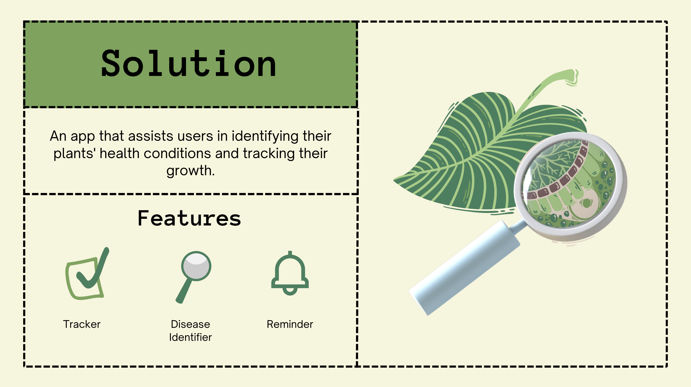
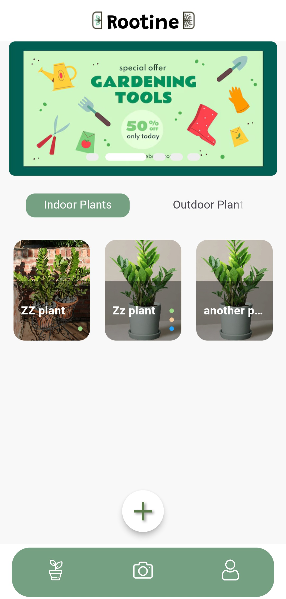
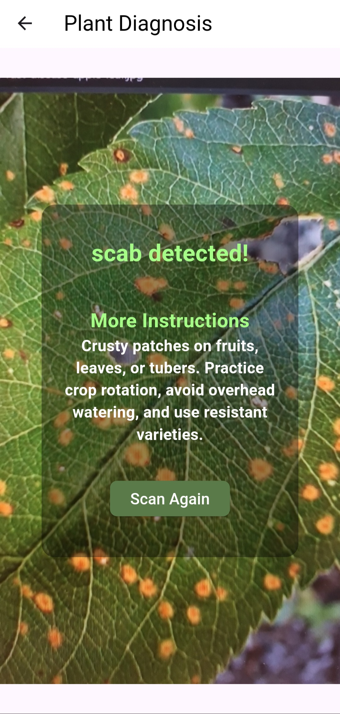
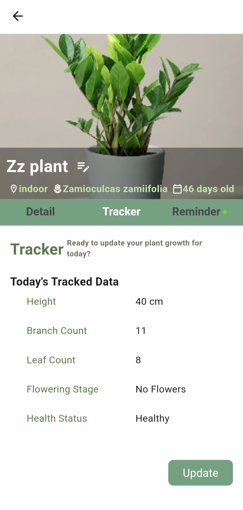
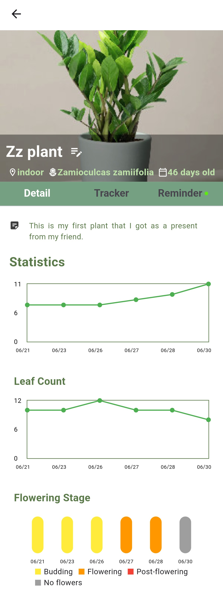

# 🌱 Rootine – Smart Plant Care & Disease Detection

Rootine is an AI-powered **mobile application** designed to **help plant lovers, gardeners, and farmers** diagnose plant diseases and optimize plant care.  
🌍 Built with **Flutter** (Frontend) & **Flask** (Backend), Rootine integrates machine learning for **plant disease identification** and provides personalized plant tracking and reminders.  

🚀 **Watch the Project Video:** [YouTube Link](#)  

## 🖼 UI Screenshots

| Home Page | Disease Identifier | Plant Tracker | Plant Profile |
|-----------|--------------------|--------------| --------------|
|  |  |  |  |

## ✨ Features

### 🔐 User Authentication
✅ **Sign Up & Login** – Secure access with email & password.  
✅ **Password Reset** – Recover your account via email verification.  

### 🌿 Plant Disease Identifier
📸 **Upload or Capture Plant Images** – Supports **JPEG, PNG** formats.  
🧠 **AI-Powered Analysis** – Detects **10+ plant diseases** (including healthy plants).  
📊 **Get Instant Results** – Disease name, description, and treatment suggestions.  

### 📊 Plant Tracker
📝 **Create & Manage Plant Profiles** – Track name, species, and planting date.  
📈 **Monitor Growth** – Log height, leaves, flowering, and overall health.  
⏰ **Smart Reminders** – Get notifications for watering, fertilizing, and maintenance.  

### 🛠 Installation & Setup Guide - [View](rootine/rootine/README.md)

